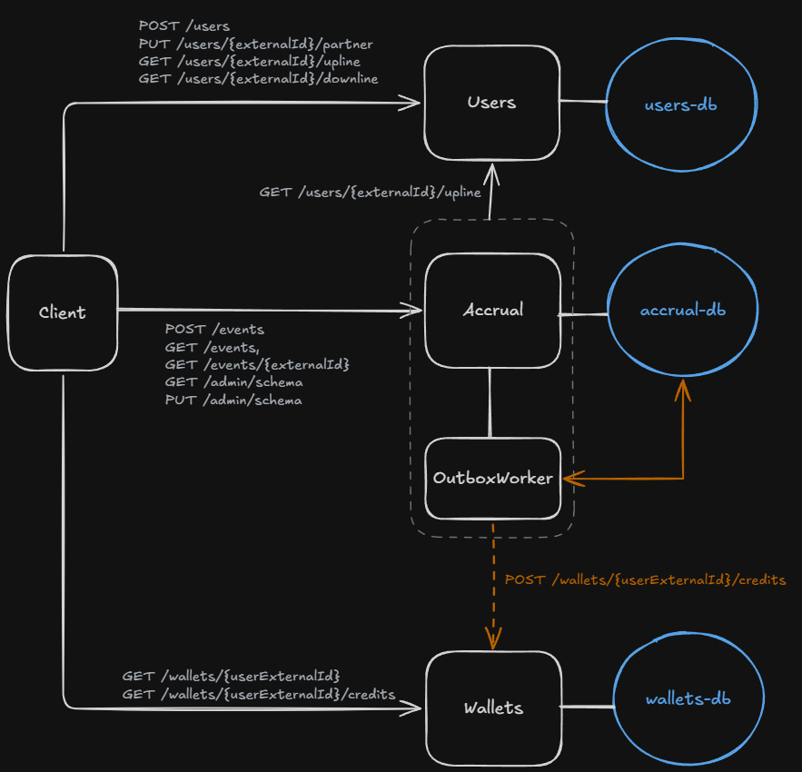

# Partner Commissions

Тестовое задание: система партнёрских отчислений. Три сервиса - Users (пользователи и дерево партнёров), Accrual (
события и комиссии) и Wallets (кошельки и выплаты), у каждого своя база PostgreSQL. Всё поднимается одной командой в
Docker.

## Стек

- .NET 10, ASP.NET Core, EF Core
- PostgreSQL
- Docker и Docker Compose
- Polly (Microsoft.Extensions.Http.Resilience)
- OpenTelemetry, Prometheus, Grafana

## Запуск

```bash
docker compose up -d --build
```

Миграции применяются сами при старте сервисов. Accrual стартует после того, как Users и Wallets стали доступны. Порты
сервисов заданы диапазонами (для поднятия нескольких реплик)

Prometheus - http://localhost:9090, Grafana - http://localhost:3000 (admin / admin).

## Тесты

```
dotnet test
```

## Эндпоинты

### Users

**`POST /users`** - создать пользователя, партнёр необязателен.

```json
{ 
	"externalId": "carol", 
	"partnerExternalId": "bob" 
}
```

**`GET /users/{externalId}`** - пользователь и его партнёр.

```json
{
	"externalId": "carol", 
	"partnerExternalId": "bob", 
	"createdAt": "2026-09-28T10:00:00+00:00"
}
```

**`PUT /users/{externalId}/partner`** - установить, сменить или убрать партнёра (`null`).

```json
{
	"partnerExternalId": "alice"
}
```

**`GET /users/{externalId}/upline`** — цепочка партнёров вверх, до 10 уровней. Уровень 1 - прямой партнёр.

```json
[
	{ 
		"externalId": "bob",   
		"partnerExternalId": "alice", 
		"level": 1 
	},
	{ 
		"externalId": "alice", 
		"partnerExternalId": null,    
		"level": 2
	}
]
```

**`GET /users/{externalId}/downline`** - приглашённые вниз, до 10 уровней и не больше 1000 человек, ближние уровни
первыми. Формат ответа тот же, что у upline.

### Accrual

**`POST /events`** - принять событие и посчитать комиссии по текущей схеме. `profit` может быть отрицательным, до 4
знаков после запятой.

```json
{
	"externalId": "event-1",
	"userExternalId": "carol",
	"profit": 1000
}
```

**`GET /events/{externalId}`** - событие и все комиссии по нему.

```json
{
	"externalId": "event-1",
	"userExternalId": "carol",
	"profit": 1000.0000,
	"createdAt": "2026-09-28T10:00:00+00:00",
	"commissions": [
		{ 
			"beneficiaryExternalId": "bob",
			"level": 1, 
			"amount": 10.0000, 
			"schemaType": "Linear", 
			"isPaid": true, 
			"paidAt": "2026-09-28T10:00:05+00:00" 
		},
		{
			"beneficiaryExternalId": "alice",
			"level": 2,
			"amount": 20.0000,
			"schemaType": "Linear",
			"isPaid": true,
			"paidAt": "2026-09-28T10:00:05+00:00"
		}
	]
}
```

**`GET /events?userExternalId=carol&page=1&pageSize=50`** - события пользователя без комиссий

```json
[
	{
		"externalId": "event-1",
		"profit": 1000.0000, 
		"createdAt": "2026-09-28T10:00:00+00:00"
	} 
]
```

**`GET /admin/schema`** - текущая схема начисления.

```json
{ 
	"schemaType": "Linear"
}
```

**`PUT /admin/schema`** - переключить схему: `Linear` или `Fibonacci`.

```json
{
	"schemaType": "Fibonacci"
}
```

### Wallets

**`GET /wallets/{userExternalId}`** - баланс, сумма выплаченных комиссий.

```json
{
	"userExternalId": "alice", 
	"balance": 20.0000 
}
```

**`GET /wallets/{userExternalId}/credits?page=1&pageSize=50`** - история выплат, новые первыми.

```json
[
	{
		"commissionId": "01a0da64-124f-7db4-a5a3-2a2a8099da8b",
		"eventExternalId": "event-1",
		"amount": 20.0000,
		"creditedAt": "2026-09-28T10:00:05+00:00"
	}
]
```

**`POST /wallets/{userExternalId}/credits`** - зачислить комиссию. (*прим.* необходимо закрыть от внешнего пользователя,
так как данный эндпоинт предназначен только для outbox)

```json
{
	"commissionId": "01a0da64-124f-7db4-a5a3-2a2a8099da8b",
	"eventExternalId": "event-1",
	"amount": 20.0000
}
```

## Схема взаимодействия



## Решения

1. Защита от двойных начислений в трёх местах:
    - повтор события узнаётся по уникальному `externalId` - отвечаю 200 с тем же результатом, комиссии заново не
      считаются;
    - выплата уходит в Wallets через outbox: сообщение сохраняется в одной транзакции с комиссией, поэтому не теряется,
      а фоновый процесс повторяет отправку, пока не получит подтверждение;
    - из-за повторов одна выплата может прийти в Wallets дважды, поэтому там уникальный `commissionId` - второй раз не
      зачисляется.
2. Блокировка дерева.
   При смене партнёра проверяю цикл: иду от нового партнёра вверх, и если встретил самого пользователя - отказ (422). Но
   двух одновременных запросов (A -> B и B -> A) одна проверка не остановит - каждый видит дерево без цикла. Поэтому все
   изменения дерева берут одну блокировку `pg_advisory_xact_lock`, и второй запрос проверяет уже обновлённое дерево.
3. Устойчивость (Polly)
   Вызовы Users и Wallets настроены по-разному. Users вызывается синхронно внутри `POST /events` - там короткие
   повторы (2 * 200 мс) и circuit breaker: если Users лежит, клиент сразу получает 503, а не ждёт таймауты. Wallets
   вызывается через outbox - там только circuit breaker и таймаут, без повторов: outbox и так повторяет доставку с
   паузой до 5 минут, повторы внутри повторов только удлиняли бы ожидание.
4. Схема начисления хранится в базе Accrual:
   Переключение через API без перезапуска, и все реплики видят одно значение. Храню не одну строку, а журнал
   переключений - текущая схема это последняя запись (если журнал пустой - Linear). Это аудит: видно, когда и на что
   переключали, и это можно сопоставить с датами комиссий.
5. Баланс не храню отдельной колонкой, а считаю `SUM` по журналу зачислений.
   Так он не может разойтись с журналом, а зачисление это просто `INSERT` без проблем с одновременными обновлениями.
   Если на больших объёмах `SUM` станет медленным, то добавил колонку, но обновлял бы атомарно (
   `UPDATE balance = balance + x`).
6. Метрики сервисы сами отправляют в Prometheus по OTLP
   Prometheus-экспортёр OpenTelemetry для .NET до сих пор в pre-release, а OTLP-экспортёр стабильный. У сервисов нет
   своего `/metrics`, смотреть метрики можно только в Prometheus или Grafana.